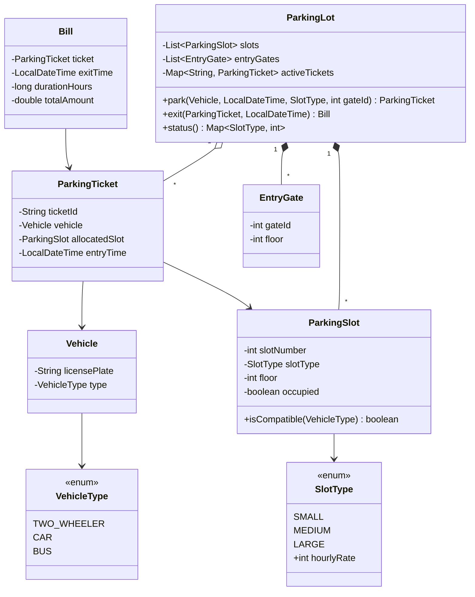

# Multilevel Parking System Design

This project implements a scalable, multilevel parking lot system in Java. It supports multiple vehicle types, slot upsizing, time-based billing, and nearest-gate slot allocation.

## Class Diagram

## Explanation of Design & Approach

1. **Separation of Concerns:** 
   - Entities like `Vehicle`, `ParkingSlot`, and `EntryGate` are simple POJOs (Plain Old Java Objects) that only maintain their own state.
   - `ParkingTicket` and `Bill` handle record-keeping.
   - Core domain logic (parking, exiting, status) is strictly encapsulated within the orchestrator class, `ParkingLot`. This separation makes it easy to add new requirements like varying payment methods or new floors without modifying the entire system.

2. **Enum-Driven Configuration:**
   - Instead of hardcoding rules, enums (`VehicleType` and `SlotType`) handle matrix-based logic. `VehicleType` knows what slot types are allowed for it (e.g., a `CAR` can go into `MEDIUM` or `LARGE`). `SlotType` holds its respective hourly billing rate.
   - When billing is generated, the rate is pulled straight from the allocated `SlotType`, cleanly satisfying the requirement that an upsized vehicle pays the upsized rate.

3. **Nearest-Slot Strategy (Distance Heuristic):**
   - We assign "floors" to both `EntryGate` and `ParkingSlot`.
   - When finding an optimal slot, Java Streams are used to filter free, compatible slots. We calculate the absolute distance (`|slot.floor - gate.floor|`) and sort it in ascending order, breaking ties by `slotNumber`. This ensures `O(N log N)` allocation logic dynamically based on where the vehicle entered.

---

My main goal was to build a system that manages different vehicle types across multiple floors, automatically handles slot upsizing, calculates precise billing, and allocates slots intelligently based on the entry gate. 

Here is the step-by-step breakdown of how I designed the system from the ground up:

1. **Defining the Base Entities and Enums:**
   - I started by defining the core properties using Enums. `VehicleType` defines the types of vehicles (Two-Wheeler, Car, Bus) and uniquely maps each to the `SlotType`s they are allowed to park in.
   - `SlotType` (Small, Medium, Large) securely stores the hourly billing rate for that specific slot size.

2. **Creating the Data Models:**
   - Next, I created simple, state-holding objects. A `Vehicle` holds its license plate and type. A `ParkingSlot` knows its floor number, slot number, type, and whether it's currently occupied. An `EntryGate` also knows which floor it is on.
   - For record-keeping, I created `ParkingTicket` (generated at entry) and `Bill` (generated at exit). 

3. **Building the Core Orchestrator:**
   - Instead of scattering logic, I encapsulated all operations inside a central `ParkingLot` class. This class acts as the system's brain and maintains the master lists of slots, entry gates, and active tickets.

4. **Designing the Allocation Strategy:**
   - The most complex requirement was finding the smallest compatible slot nearest to the entry gate. 
   - When `park()` is called, the system grabs all free slots and filters them using the `VehicleType` compatibility matrix we defined earlier, ensuring the slot size is at least as large as what was requested (handling the upsizing rule).
   - Then, it sorts the remaining slots by the absolute distance between the gate's floor and the slot's floor, breaking ties by slot number. This dynamically finds the perfect, closest slot.

5. **Handling Checkout and Billing:**
   - For checkout, the `exit()` method takes the original `ParkingTicket` and immediately frees up the slot.
   - It generates a `Bill` by calculating the parking duration, rounding up to the nearest hour. Crucially, the system charges based on the allocated `SlotType` rate—which is pulled directly from the Enum—completely satisfying the rule that an upsized vehicle pays the upsized rate automatically.

**Conclusion:**
By separating data models from core operations and leveraging enums for business rules, the architecture remains highly cohesive and loosely coupled. Adding a new floor or a new vehicle type would only require a simple configuration update without breaking the core logic. Thank you, I can take any questions now."
