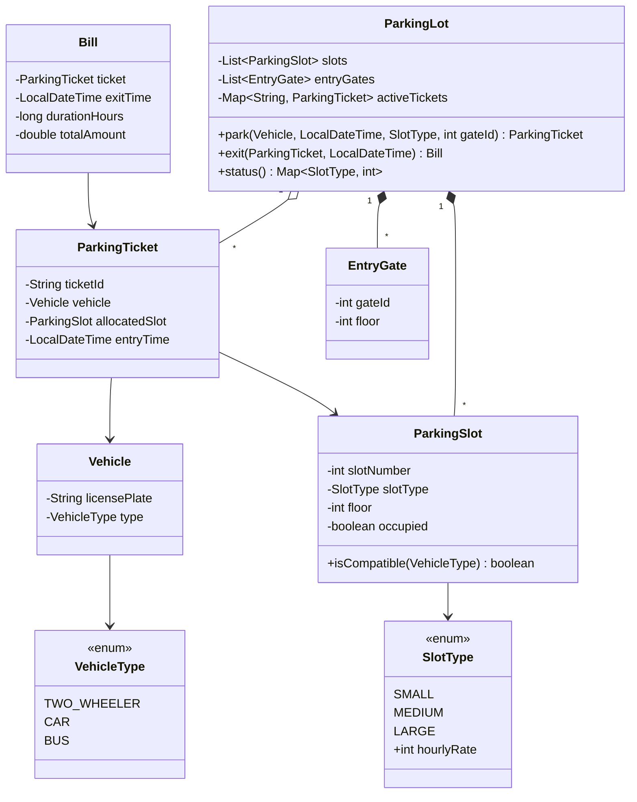

# Multilevel Parking System Design

This project implements a scalable, multilevel parking lot system in Java. It supports multiple vehicle types, slot upsizing, time-based billing, and nearest-gate slot allocation.

## Class Diagram

## Explanation of Design & Approach

1. **Separation of Concerns:** 
   - Entities like `Vehicle`, `ParkingSlot`, and `EntryGate` are simple POJOs (Plain Old Java Objects) that only maintain their own state.
   - `ParkingTicket` and `Bill` handle record-keeping.
   - Core domain logic (parking, exiting, status) is strictly encapsulated within the orchestrator class, `ParkingLot`. This separation makes it easy to add new requirements like varying payment methods or new floors without modifying the entire system.

2. **Enum-Driven Configuration:**
   - Instead of hardcoding rules, enums (`VehicleType` and `SlotType`) handle matrix-based logic. `VehicleType` knows what slot types are allowed for it (e.g., a `CAR` can go into `MEDIUM` or `LARGE`). `SlotType` holds its respective hourly billing rate.
   - When billing is generated, the rate is pulled straight from the allocated `SlotType`, cleanly satisfying the requirement that an upsized vehicle pays the upsized rate.

3. **Nearest-Slot Strategy (Distance Heuristic):**
   - We assign "floors" to both `EntryGate` and `ParkingSlot`.
   - When finding an optimal slot, Java Streams are used to filter free, compatible slots. We calculate the absolute distance (`|slot.floor - gate.floor|`) and sort it in ascending order, breaking ties by `slotNumber`. This ensures `O(N log N)` allocation logic dynamically based on where the vehicle entered.

---

**Introduction:**
In my design for a Multilevel Parking System. The objective was to build a system that manages three types of vehicles—2-wheelers, cars, and buses—across multiple floors, handles automated upsize slot assignments if smaller slots are full, calculates billing correctly based on the final slot used, and allocates intelligently based on the gate the vehicle entered from."

**Core Entities & Data Flow:**
"At the center of my design is the `ParkingLot` class. It manages three main collections: a list of `ParkingSlot` objects, a map of `EntryGate` objects, and a map of active `ParkingTicket`s. When a `Vehicle` arrives at an `EntryGate`, the system captures its details and timestamp, and triggers the `park()` method."

**The Allocation Strategy (The 'Brain' of the system):**
"The most interesting part of the requirement is the allocation logic. It requires finding the smallest compatible slot nearest to the entry gate. 
I approached this using an Enum-based compatibility matrix. The `VehicleType` enum defines exactly which `SlotType` it can fit into. This removes messy 'if-else' ladders from the core code.
To find the 'nearest' slot relative to the gate, I assigned a `floor` property to both slots and gates. The system filters all free, compatible slots, and uses a custom sorting comparator to find the slot with the smallest distance to the entry gate floor, breaking ties by slot number."

**Checkout and Billing:**
"For checkout, the `exit()` method takes the original `ParkingTicket` and the exit timestamp. It frees up the `ParkingSlot` immediately. Then, a `Bill` object is generated. One trick here is the billing rule: a vehicle upgraded to a larger slot must pay the larger rate. To handle this cleanly, my design ties the hourly rate directly to the `SlotType` enum, not the vehicle. The `Bill` class rounds up the duration to the nearest whole hour and multiplies it by the allocated slot's rate."

**Conclusion:**
"This object-oriented structure ensures the code is highly cohesive and loosely coupled. If tomorrow we wanted to add a floor or introduce 'Electric Vehicle' slots, we would just add a configuration to the initialization or the enums, without touching the core assignment logic.
